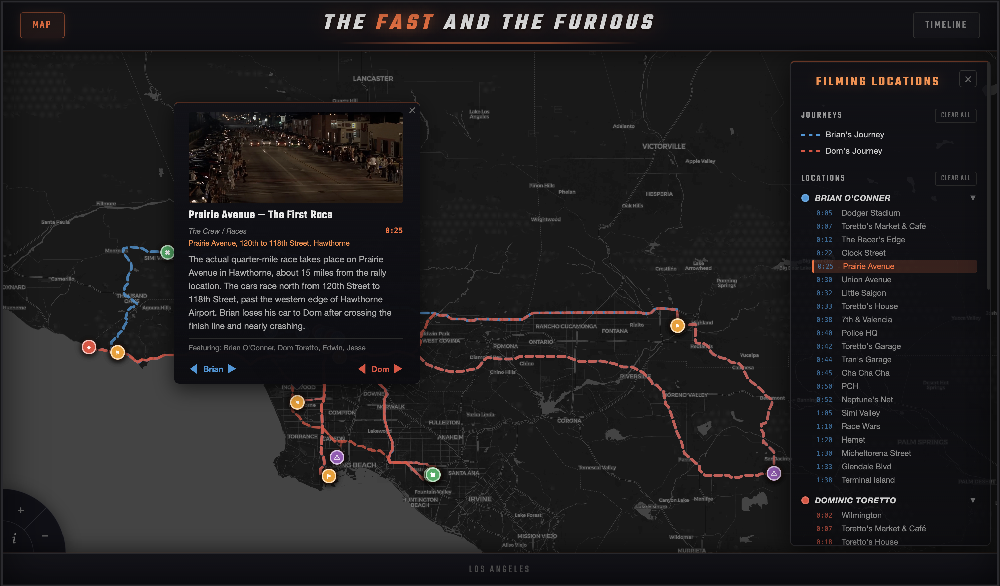

# The Fast & The Furious — Filming Locations Map & Timeline

An interactive map and timeline of real-world filming locations from *The Fast and the Furious* (2001), built as a zero-dependency static site with Leaflet.



## Features

- **Interactive map** — explore 50+ filming locations across the greater Los Angeles area, color-coded by character/storyline (Brian, Dom, Tran, The Crew, The Heists)
- **Character journeys** — toggle road-routed polylines tracing Brian's and Dom's paths through the film, with pre-cached route geometry
- **Scene-linked connections** — narrative event links connect locations in story order, showing how the plot moves through LA
- **Timeline view** — browse locations in scene order with timestamps, film stills, descriptions, and "View on Map" links
- **Deep linking** — jump from the timeline straight to a specific marker on the map via URL parameters
- **Basemap toggle** — switch between a dark Carto basemap and standard OpenStreetMap tiles
- **Filter & navigate** — show/hide categories in the legend; click any location to fly to it on the map

## Getting Started

This is a zero-dependency static site — no build step or `npm install` required.

### Serve locally

Any static HTTP server will work:

```bash
# Python
python3 -m http.server 8080

# Node (npx)
npx serve .
```

Then open [http://localhost:8080](http://localhost:8080).

> Opening `index.html` directly via `file://` may cause CORS issues with tile providers. Use an HTTP server.

## Project Structure

```
├── index.html        # Map page (Leaflet + inline CSS/JS)
├── timeline.html     # Timeline page (vanilla JS)
├── data.js           # Shared location data, categories, journeys, and event links
├── routes.js         # Pre-cached encoded polyline geometry for character journeys
├── regen_routes.js   # Node script to regenerate routes.js via the Valhalla routing API
├── assets/           # Favicons and film stills (screengrabs/) used in popups and timeline
├── backup/           # Archived data and routes for fast-2 and fast-3 (not active)
└── README.md
```

## Tech Stack

| Component | Technology |
|-----------|------------|
| Map | [Leaflet 1.9.4](https://leafletjs.com/) via CDN |
| Tiles | [Carto Dark Matter](https://carto.com/basemaps/) / OpenStreetMap |
| Routing | Pre-cached polylines generated via [Valhalla](https://valhalla.openstreetmap.de/) |
| Fonts | [Teko](https://fonts.google.com/specimen/Teko) via Google Fonts |
| Runtime | Vanilla HTML, CSS, and JavaScript — no frameworks or bundlers |

## Data

All location data lives in `data.js` inside the `MOVIES["fast-1"]` object. Each event entry includes:

- Scene order and in-film timestamp
- Latitude/longitude and real-world address
- Description, characters, and category
- Reference to a film still in `assets/screengrabs/`

The file also defines `EVENT_LINKS` (narrative connections between locations) and `JOURNEYS` (waypoints for Brian's and Dom's routes through the film).

Location information sourced from [movie-locations.com](https://www.movie-locations.com) and [seeing-stars.com](https://www.seeing-stars.com) as well as the screenplay.

### Regenerating routes

Route geometry in `routes.js` is pre-cached so the map works without live API calls. To regenerate after changing journey waypoints:

```bash
node regen_routes.js
```

This fetches road-snapped routes from the public Valhalla instance and writes encoded polylines to `routes.js`.

## License

This is a fan project for educational purposes. *The Fast and the Furious* is a trademark of Universal Pictures.
